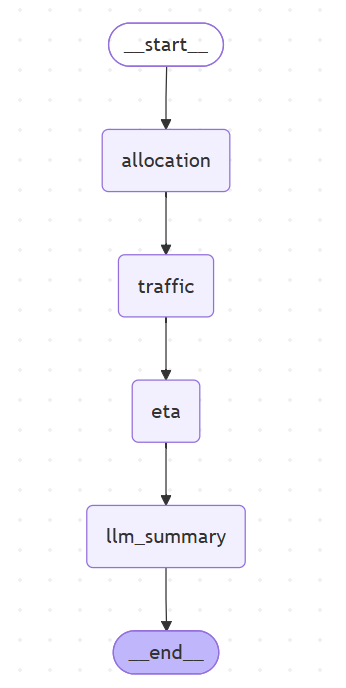

# Autonomous Route Optimization Agent

This project demonstrates an agentic AI architecture for fleet route optimization, combining an ETA prediction model, traffic simulation, and LLM-based orchestration, exposed via a FastAPI service. [file:1]

## Status

This first version includes:

- Project structure with clear layering (`api`, `agents`, `ml`, `services`, etc.)
- A minimal FastAPI app with a `/api/health` endpoint
- Environment-based configuration for future ML, LLM, and database components

Subsequent commits will add:

- An XGBoost-based ETA model
- Multi-agent orchestration (planner, ETA, traffic, allocation)
- LangChain/LangGraph-based LLM reasoning
- Dockerization, tests, and documentation

## ETA model

The project includes an ETA prediction component built using XGBoost on synthetic telemetry-style trip data. [file:1]

To train the model:

```bash
python app/ml/train_eta_model.py
```

This will:

- Generate `data/synthetic_trips.csv`
- Train an XGBoost regression model on features like origin, destination, distance, time of day, day of week, and traffic level
- Save the trained model to `app/ml/eta_model.joblib`

The synthetic ETA model also incorporates simple route history features such as average historical ETA, number of past trips, and on-time ratio for a given origin-destination pair, reflecting how telemetry-based ETA models are built in production. [file:1]

## LLM-based orchestration

The project includes a LangGraph-based orchestration layer that wraps the classical agents (allocation, traffic, ETA) as tools and uses an OpenAI LLM to generate a concise explanation of the selected route plan. [file:1]

You can enable this path via:

```bash
curl ".../api/optimize_routes?use_llm=true" ...
```

The LLM prompt is defined in `app/prompts/optimization_prompt.txt`, and the client configuration lives in `app/services/llm_service.py`.

## Repository structure

```text
app/
  api/            # FastAPI routes and schemas
  agents/         # Allocation, route, traffic, ETA agents and orchestrators
  ml/             # ETA model training and inference
  services/       # LLM service (LangChain/OpenAI)
  prompts/        # LLM prompt templates
  utils/          # Configuration and logging

data/             # Synthetic telemetry and route data
tests/            # Unit and API tests
docs/             # Architecture and diagrams
docker/           # Dockerfile
```

## Orchestrator LLM workflow

